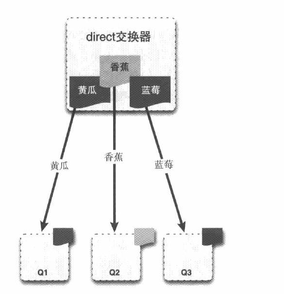

1. 交换器类型：direct、fanout、topic、headers。

### direct交换器：如果路由键匹配的话，消息就投递到对应的队列。

### fanout交换器：交换器会将收到的消息广播到绑定的队列上。
当你发送一条消息到fanout交换器时，它会把消息投递给所有附加在此交换器的队列上。

### topic交换器：交换器会将收到的消息广播到绑定的队列上。

- AMQP架构中最关键的几个组件分别是交换器、队列和绑定。
- 根据绑定规则将队列绑定到交换器上。
- 消息是发布到交换器上的。
- 由三种类型的交换器：direct、fanout、topic。
- 基于消息的路由键和交换器类型，服务器会决定将消息传递到哪个队列上去。

1. 多租户模式：虚拟主机和隔离
每个RabbitMQ服务器都能创建虚拟消息服务器（vhost）;每个vhost本质上是一个mini版的RabbitMQ服务器，
拥有自己的队列、交换器和绑定，更重要的是，拥有自己的权限机制。
vhost