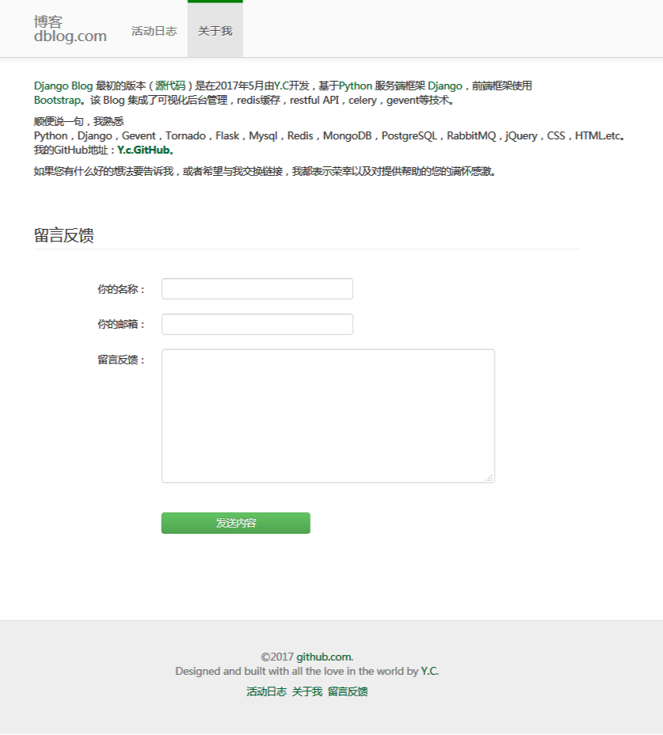
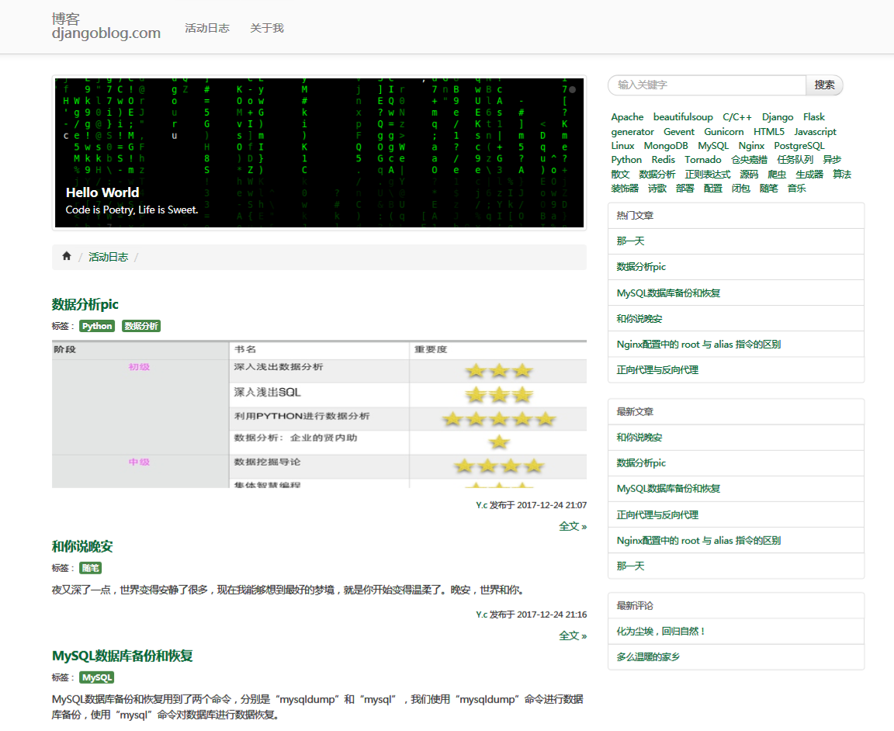
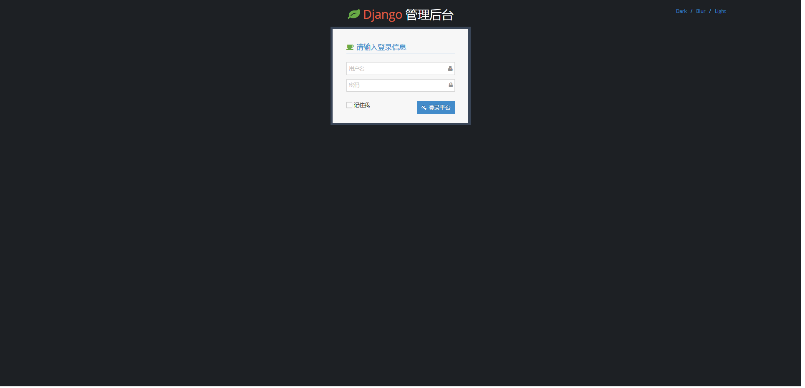
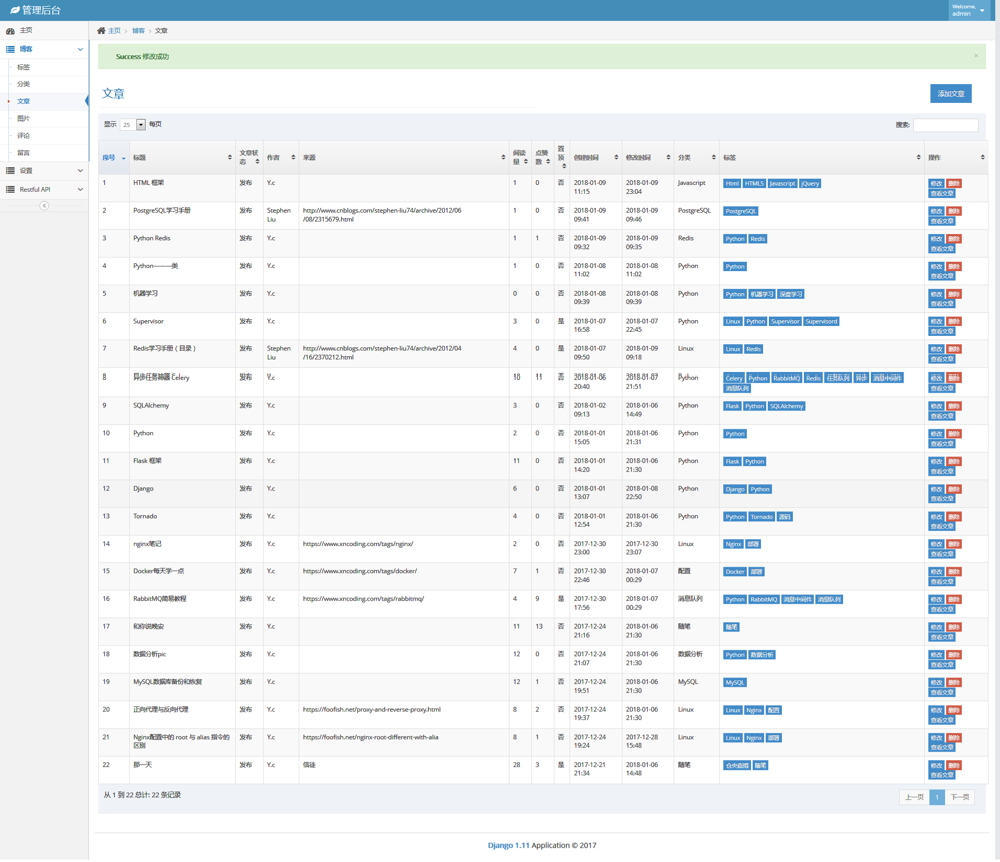
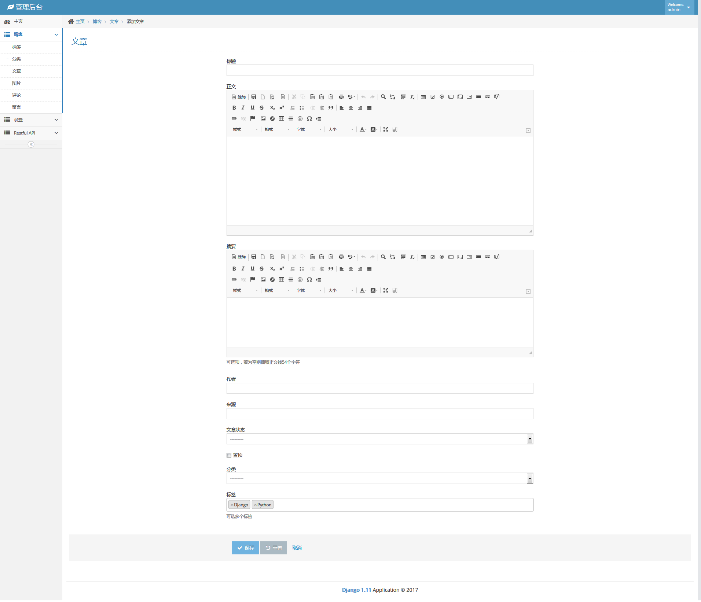
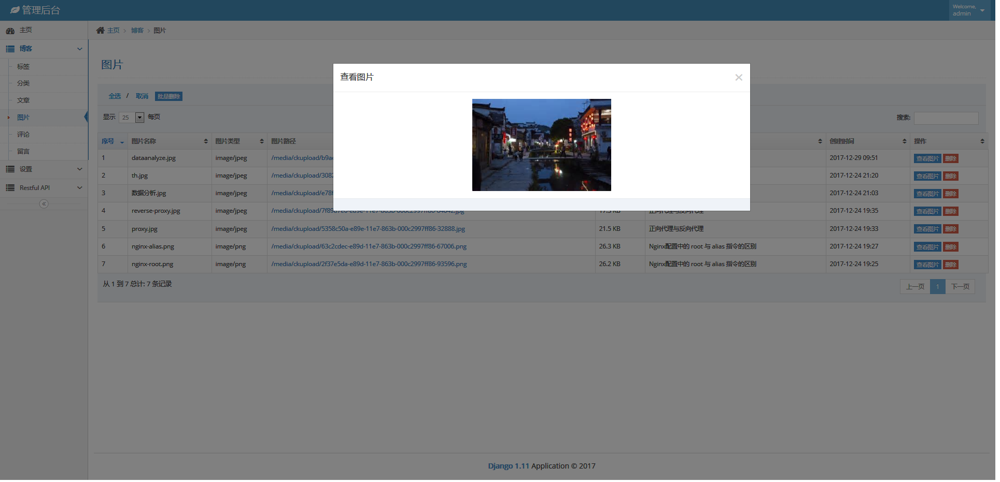

# dblog
Django 1.11 管理平台，博客, 页面缓存，celery，restful API，脚本等 

### Requirement
------------
(Python >= 2.7)
* Django==1.11.3

### Screenshots
-----------
* About —— 关于我

* Posts —— 文章

* Login —— 登录

* Article —— 文章管理

* Article (Edit Post) 

* Pic    —— 图片管理

### 文档链接
-----------
参考文档：
- [Django 1.11.6 文档](http://python.usyiyi.cn/translate/Django_111/index.html)
- [Django 设计模式与最佳实践](https://wizardforcel.gitbooks.io/django-design-patterns-and-best-practices/index.html)
- [django latest](http://django-intro-zh.readthedocs.io/zh_CN/latest/)
- [Django 1.8.2](http://python.usyiyi.cn/translate/django_182/index.html)

最新版本 django 2.0, 文档：
- [The Django Book](http://djangobook.py3k.cn/2.0/)
- [Django 2.0](https://wizardforcel.gitbooks.io/django-book-20-zh-cn/content/1.html)

使用的css框架 ace Admin， 网址：
- [Ace Admin](http://ace.jeka.by/index.html)
- [Vue+Django REST Framework生鲜电商项目学习笔记——概览 ](http://lawtech0902.com/2017/11/03/vue-django-1-1/)

### 富文本编辑器
- [CKEditor 4](https://ckeditor.com/ckeditor-4/download/)
- [CKEditor 4](https://ckeditor.com/ckeditor-4/download/releases/)
- [ckeditor的详细配置](http://www.blogjava.net/liangcmwn/archive/2011/10/13/361112.aspx)

## 缓存
### 本处只用到页面缓存，也可以部分缓存，还可以用redis处理异步任务等
- [Django中使用Redis进行缓存](https://python.freelycode.com/contribution/detail/618)
- [Caching in Django With Redis ](https://realpython.com/blog/python/caching-in-django-with-redis/)
- [Django缓存系统](http://www.cnblogs.com/linxiyue/p/7494540.html)
- [Django分析之使用redis缓存服务器](http://www.cnblogs.com/fuhuixiang/p/4174896.html)

## Restful api
- [Django-REST-framework教程中文版](https://darkcooking.gitbooks.io/django-rest-framework-cn/content/)
- [Django REST FrameWork中文文档目录](http://www.chenxm.cc/post/299.html?zhihu)
- [django-rest-framework](http://www.django-rest-framework.org/)
- [用python为mysql实现restful接口](http://www.vimer.cn/archives/2942.html)
- [Django REST framework](http://www.django-rest-framework.org/)
- [Restful API 的设计规范](https://novoland.github.io/%E8%AE%BE%E8%AE%A1/2015/08/17/Restful%20API%20%E7%9A%84%E8%AE%BE%E8%AE%A1%E8%A7%84%E8%8C%83.html)
- [RESTful API 设计指南](http://www.ruanyifeng.com/blog/2014/05/restful_api.html)
- [RESTful API 编写指南](https://blog.igevin.info/posts/restful-api-get-started-to-write/)
- [Django 中 REST API 的设计 ——包含权限设置](http://python.jobbole.com/87226/)

## Celery  
### gevent + redis + mysql 一样可以达到异步的效果，Celery只是看起来工整一些(大型项目可以考虑)  ###
- [异步任务利器Celery(一)介绍](http://www.cnblogs.com/linxiyue/p/7502561.html)
- [异步任务利器Celery(二)在django项目中使用Celery](http://www.cnblogs.com/linxiyue/p/7518535.html)
- [django celery demo](https://github.com/celery/celery/tree/master/examples/django)

## Django调试工具django-debug-toolbar
- [django debug toolbar 安装](https://www.phodal.com/blog/django-install-django-debug-toolbar/)
- [django debug toolbar使用简介，及docker中使用](http://blog.csdn.net/permike/article/details/54706091)
- [Django Debug Toolbar在Docker中的使用](https://zhuanlan.zhihu.com/p/31288654)
- [Django Debug Toolbar在Docker中的使用](https://www.ctolib.com/topics-117992.html)

## apache + nginx 部署
详情请查看doc文件配置
- [django, CentOS7+nginx(apache)+mod_wsgi+Python+Django，djangocentos7](http://www.bkjia.com/Pythonjc/1223954.html)
- [Django 部署(Apache)](https://code.ziqiangxuetang.com/django/django-deploy.html)
### 部署nginx  要将rest_framework 模块下的 js css 移到 static目录下面即可

## 压力测试
- [用Webbench进行网站压力测试](http://blog.csdn.net/jk110333/article/details/9190687)
webbench -c 1000 -t 30 http://192.168.1.24:8080/article/1/
webbench -c 1000 -t 30 http://dgblog.com/about/

