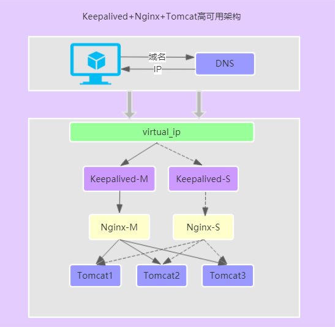

- [CentOS 7 配置 Keepalived 实现双机热备](https://qizhanming.com/blog/2018/05/17/how-to-config-keepalived-on-centos-7)
- [keepalived + nginx 高可用配置](https://www.zfl9.com/keepalived-nginx.html)
- [Nginx与Keepalived 实现站点高可用方案](https://www.jianshu.com/p/1f781bc36935)
- [nginx结合keepalived实现web服务器高可用方案](https://www.centos.bz/2017/08/nginx-keepalived-web-ha/)
- [Nginx+Keepalived实现站点高可用](Nginx+Keepalived实现站点高可用)
- [Keepalived双主模型中vrrp_script中权重改变故障排查](https://blog.51cto.com/xxrenzhe/1405571)
- [虚拟路由器冗余协议【原理篇】VRRP详解](https://blog.51cto.com/zhaoyuqiang/1166840)
- [搭建Keepalived + Nginx + Tomcat的高可用负载均衡架构](https://my.oschina.net/feinik/blog/1590941)
- [使用 keepalived 设置虚拟 IP 环境](https://www.jianshu.com/p/1455b30dc976)


Keepalived 是集群管理中保证集群高可用的一个服务软件，其功能类似于 heartbeat，用来防止单点故障。 本例演示 CentOS 7 下安装和配置 Keepalived 的基本步骤。
Keepalived 是以 VRRP（Virtual Router Redundancy Protocol，虚拟路由冗余协议）协议为实现基础的，这个协议可以认为是实现了路由器高可用的协议，将多台提供相同功能的路由器组成一个路由器组。

这里面有一个 MASTER 和多个 BACKUP；
MASTER 上面有一个对外提供服务的 Virtual IP(VIP)；
MASTER 会发组播，当 BACKUP 收不到 VRRP 包时就认为 MASTER 宕机
这时需要根据 VRRP 优先级来选举一个 BACKUP 为 MASTER，这样就保证路由器的正常使用了。

## Nginx的高可用负载均衡架构


（1）用户通过域名请求到DNS，由DNS解析域名后返回对应的IP地址，该IP及为Keepalived映射服务器的虚拟IP
（2）通过该虚拟IP访问到对应的负载均衡器（Nginx），这里Nginx部署两个，然后通过Keepalived来保证NG的高可用，
    正常情况下由Keepalived-M将虚拟IP映射转发至Nginx-M，如果Nginx-M出现故障，此时Keepalived会切换至Keepalived-S开始工作，从而保证了NG的单点故障问题。
（3）通过Nginx负载均衡器，将请求路由到对应的Tomcat服务。

## 3 搭建Keepalived + Nginx + Tomcat的高可用负载均衡架构
Keepalived 是一个基于 VRRP 协议来实现的服务高可用方案，可以利用其来避免 IP 单点故障，类似的工具还有 heartbeat、corosync、pacemaker。
但是它一般不会单独出现，而是与其它负载均衡技术（如 LVS、HAProxy、Nginx）一起工作来达到集群的高可用。

实验环境 CentOS7
VIP1：192.168.1.11
VIP2：192.168.1.12
互为主备，实现高可用

- keepalived 安装
```
yum -y install keepalived
```

- keepalived 配置(server1)
修改主机（192.168.1.11）keepalived配置文件
```
global_defs {
  ## keepalived自带的邮件提醒需要开启sendmail服务。建议用独立的监控或第三方SMTP
  ## 标识本节点的字条串，通常为 hostname
  router_id 192.168.1.11
}

## keepalived会定时执行脚本并对脚本执行的结果进行分析，动态调整vrrp_instance
##  的优先级。如果脚本执行结果为0，并且weight配置的值大于0，则优先级相应的增加。
## 如果脚本执行结果非0，并且weight配置的值小于 0，则优先级相应的减少。其他情况，
## 维持原本配置的优先级，即配置文件中priority对应的值。
vrrp_script chk_nginx {
    script "/etc/keepalived/nginx.sh"   ## 检测 nginx 状态的脚本路径
    interval 2   # 检测间隔2s
    weight -5    # 若检测失败权重减低5
    fall 3       # 检测失败3次就定义为down状态
    rise 2       # 检测失败后,检测成功超过2次就定义为up状态
}

## 定义虚拟路由，VI_1为虚拟路由的标示符，自己定义名称
vrrp_instance VI_1 {
    state MASTER                # 主节点为MASTER，对应的备份节点为BACKUP
    interface eth0              # VIP绑定网卡：绑定虚拟IP的网络接口，与本机IP地址所在的网络接口相同
    virtual_router_id 51        # 虚拟路由ID，主、备节点必须一致；多实例的情况下，ID必须不一致
    mcast_src_ip 192.168.1.11   # 本机IP
    nopreempt                   # 优先级高的设置，解决异常回复后再次抢占的问题； 优先级高的设置 nopreempt 解决异常恢复后再次抢占的问题
    priority 100                # 优先级；取值范围：0~254；MASTER > BACKUP
    advert_int 2                # 组播信息发送间隔，主、备节点必须一致，默认1s
    
    # 设置验证信息，两个节点必须一致
    authentication {            # 验证信息；主、备节点必须一致
          auth_type PASS        # VRRP验证类型，PASS、AH两种
          auth_pass 1111        # VRRP验证密码，在同一个vrrp_instance下，主、从必须使用相同的密码才能正常通信
    }
    
    # 将 track_script 块加入 instance 配置块
    track_script {            
          chk_nginx          # 执行Nginx监控的服务
     }
     
    # 虚拟 IP 池, 两个节点设置必须一样
    virtual_ipaddress {
      192.168.1.10  # 虚拟 ip，可以定义多个
    }
}

```

- keepalived 配置(server2)
修改BACKUP 节点配置文件（192.168.1.12）  
备份服务器
```
state BACKUP     # 此值可设置或不设置，只要保证下面的priority不一致即可
interface eth0   # 根据实际情况选择网卡
priority 40      # 此值要一定小于Master机器上的值，最好相差不少于50
```

vi /etc/keepalived/keepalived.conf
```
global_defs {
  router_id 192.168.1.12
}
vrrp_script chk_nginx {
    script "/etc/keepalived/nginx.sh"   ## 检测 nginx 状态的脚本路径
    interval 2   # 检测间隔2s
    weight -5    # 若检测失败权重减低5
    fall 3       # 检测失败3次就定义为down状态
    rise 2       # 检测失败后,检测成功超过2次就定义为up状态
}
vrrp_instance VI_1 {
    state BACKUP                # 主节点为MASTER，对应的备份节点为BACKUP
    interface eth0              # VIP绑定网卡：绑定虚拟IP的网络接口，与本机IP地址所在的网络接口相同
    virtual_router_id 51        # 虚拟路由ID，主、备节点必须一致；多实例的情况下，ID必须不一致
    mcast_src_ip 192.168.1.12   # 本机IP
    nopreempt                   # 优先级高的设置，解决异常回复后再次抢占的问题； 优先级高的设置 nopreempt 解决异常恢复后再次抢占的问题
    priority 90                 # 优先级；取值范围：0~254；MASTER > BACKUP
    advert_int 2                # 组播信息发送间隔，主、备节点必须一致，默认1s
    
    # 设置验证信息，两个节点必须一致
    authentication {            # 验证信息；主、备节点必须一致
          auth_type PASS        # VRRP验证类型，PASS、AH两种
          auth_pass 1111        # VRRP验证密码，在同一个vrrp_instance下，主、从必须使用相同的密码才能正常通信
    }
    
    # 将 track_script 块加入 instance 配置块
    track_script {            
          chk_nginx          # 执行Nginx监控的服务
     }
     
    # 虚拟 IP 池, 两个节点设置必须一样
    virtual_ipaddress {
      192.168.1.10  # 虚拟 ip，可以定义多个
    }
}
```

- 创建 nginx 检测脚本
vim /etc/keepalived/nginx.sh
脚本：如果nginx停止运行，尝试启动，如果无法启动则杀死本机的keepalived进程，
keepalied将虚拟ip绑定到 BACKUP 机器上。内容如下：
```
#!/bin/bash
status=$(ss -lnp | grep -c 'nginx')
if [ ${status} == 0 ]; then
    systemctl nginx restart
    sleep 2
    status=$(ss -lnp | grep -c 'nginx')
    if [ ${status} == 0 ]; then
        systemctl stop keepalived
    fi
fi
```
chmod +x /etc/keepalived/nginx_check.sh

- keepalived 运行
```
systemctl start keepalived
ip addr show # 查看虚拟 IP
```

- Keepalived+Nginx的高可用测试
(1)关闭 192.168.1.11 中的 Nginx，Keepalived会将它重新启动
 /usr/local/nginx/sbin/nginx -s stop
 
(2)关闭 192.168.1.11 中的 Keepalived，VIP 会切换到 192.168.1.12 中
 service keepalived stop
 
(3)重新启动 192.168.1.11 中的 Keepalived，VIP 又会切回到 192.168.1.11 中来
 service keepalived start
 
附Keepalived 服务管理命令：
停止：service keepalived stop
启动：service keepalived start
重启：service keepalived restart
查看状态：service keepalived status

再次访问vip(192.168.1.10)发现这个时候页面显示的还是：192.168.1.11，这是脚本里面自动重启。
现在直接将192.168.1.11服务器关闭，在此访问vip(192.168.1.10)现在发现页面显示192.168.1.12
这个时候keepalived就自动故障转移了，一套企业级生产环境的高可用方案就搭建好了。
keepalived中还有许多功能比如：邮箱提醒啊等等，就不操作了，可以去官网看看文档。


- 配置 Nginx  分别配置两台服务器的Nginx
（1）分别修改两台服务器nginx配置文件，vim /usr/local/nginx/conf/nginx.conf
（2）内容如下：
```
# nginx进程数
worker_processes  1;

# 单个进程最大连接数
events {
    worker_connections  1024;
}

#http服务器配置
http {
    include       mime.types;
    default_type  application/octet-stream;
    sendfile        on;
	#长连接超时时间，单位是秒
    keepalive_timeout  65;
	#upstream负载均衡配置，配置路由到tomcat的服务地址以及权重
    upstream localhost{
       server 192.168.1.11:8080 weight=2;
       server 192.168.1.12:8080 weight=2;
    }
	
	#虚拟主机的配置
    server {
	    # 监听端口
        listen       80;
		# 域名可以有多个，用空格隔开
        server_name  localhost;
        location / {
            root   html;
            index  index.html index.htm;
			# nginx跟后端服务器连接超时时间(代理连接超时)
            proxy_connect_timeout 3;
			# 后端服务器数据回传时间(代理发送超时)
            proxy_send_timeout 30;
			# 连接成功后，后端服务器响应时间(代理接收超时)
            proxy_read_timeout 30;
            proxy_pass http://localhost;
        }

        error_page   500 502 503 504  /50x.html;
        location = /50x.html {
            root   html;
        }
    }
}
```

- 配置日志
keepalived 默认将日志输出到系统日志/var/log/messages中，因为系统日志很多，查询问题时相对麻烦。
我们可以将 keepalived 的日志单独拿出来，这需要修改日志输出路径。
修改 Keepalived 配置
sudo vim /etc/sysconfig/keepalived
更改如下：
```
# Options for keepalived. See `keepalived --help' output and keepalived(8) and
# keepalived.conf(5) man pages for a list of all options. Here are the most
# common ones :
#
# --vrrp               -P    Only run with VRRP subsystem.
# --check              -C    Only run with Health-checker subsystem.
# --dont-release-vrrp  -V    Dont remove VRRP VIPs & VROUTEs on daemon stop.
# --dont-release-ipvs  -I    Dont remove IPVS topology on daemon stop.
# --dump-conf          -d    Dump the configuration data.
# --log-detail         -D    Detailed log messages.
# --log-facility       -S    0-7 Set local syslog facility (default=LOG_DAEMON)
#

KEEPALIVED_OPTIONS="-D -d -S 0"
```
把 KEEPALIVED_OPTIONS=”-D” 修改为 KEEPALIVED_OPTIONS=”-D -d -S 0”，其中 -S 指定 syslog 的 facility

修改 /etc/rsyslog.conf 末尾添加
```
$ sudo vi /etc/rsyslog.conf 
local0.*                                                /var/log/keepalived.log
```

重启日志记录服务
```
$ sudo systemctl restart rsyslog
```

重启 keepalived
```
$ sudo systemctl restart keepalived
```
此时，可以从 /var/log/keepalived.log 查看日志了。

