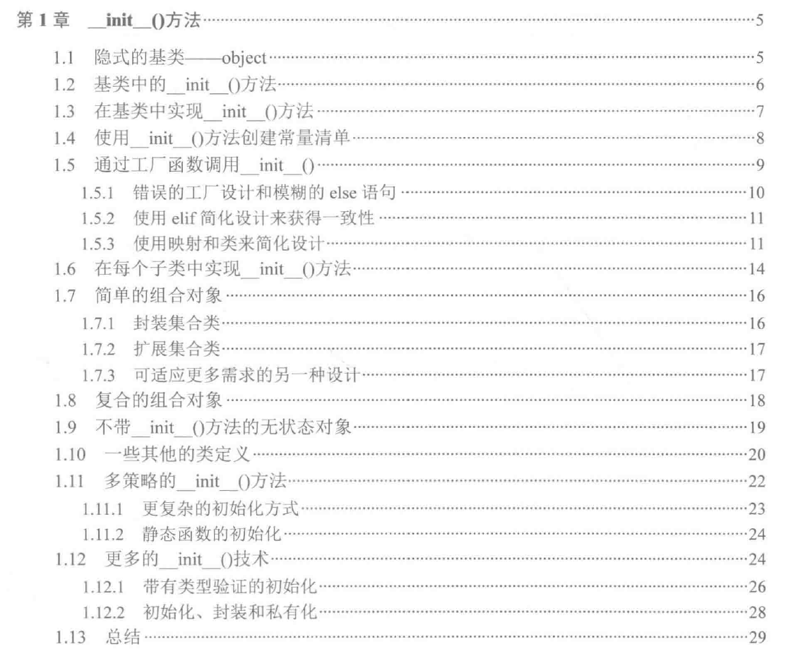

Python特殊方法，大致分为几类：

- **特性访问（Attribute Access）**：这类特殊方法实现了对象的特性访问，使用方式为obj.attribute，既可以用来赋值，也可以在del语句中执行删除操作。

- **可调用对象（Callables）**：这个方法的适用对象为参数，就像Python内部的len()函数（也是应用于参数）。

- **集合（Collections）**：提高了很多集合操作的功能

- **数字（Numbers）**：数学运算符、比较运算符

- **上下文（Context）**：这类函数通常适用with语句来实现上下文的管理

- **迭代器（Iterator）**：迭代器、生成器（Generator）

### 总结 __init__()
1. 类应禁止延迟赋值。  ——显式而非隐式， 对于每个__init__(), 都应当显式指定要初始化的变量

2. 创建常量清单， 静态常量也正构成了策略（Strategy)或状态（State)模式的一部分。

3. 实现工厂的两种途径：
> 定义一个函数，返回不同类的函数。 
> 定义一个类，包含了创建对象的方法。这是完整的工厂设计模式。复杂的情形，工厂类才是不错的选择。对于只要简单定义一个函数能做到的就没必要定义类。

4. 工厂方法包含两个常见的结构：
> if-elif 序列
> 字典映射

5. 工厂函数实现：
> 并行映射
> 元组
> partial函数
> 工程模式的流畅API设计

6. 设计集合类，通常有如下3中策略：
- 封装  基于现有集合类来定义一个新类，属于外观模式的一种场景。
- 扩展  对现有集合类进行扩展，通常使用定义子类的方式实现。
- 创建  重新设计。

7. 不带__init__()方法的无状态对象（无__init__()方法的类）
对于策略模式的对象来说是常见的设计。一个策略对象以插件的形式复合在主对象上完成一种算法或逻辑。它或许依赖主对象中的数据，策略对象自身不携带任何数据。
通常策略类会和享元模式一起使用：在策略对象中避免内部存储。
策略对象自身是无状态的，可以把它看做是一系列函数的集合。

8. 使用abc模块丰富抽象基类的实现:
组织了对抽象基类的实例化；任何没有提供bet()方法实现的子类也是不能实例化的。

9. 多策略的__init__()方法
对象的创建有多个来源，克隆对象作为备忘录模式的一部分(或者冻结一个对象以使它可以用来作为字典的键或放入哈希集合，也是set和frozenset类的实现)。

10. 静态函数的初始化
有时使用静态函数好过使用复杂的__init__()函数
类函数作为初始化的另一种选择，而将依赖的对象作为参数传入函数会更好.
静态函数作为代理构造函数。

11. 初始化、封装和私有化
一个类封装了一种数据结构、一个算法、一个外部接口等，程序设计的目的是要把接口和实现分离。
python中私有的概念很简单：
- 基本都是公有的。源代码可以随时修改，大家都是成年人，没有什么是可以被正在隐藏的。
- 传统上，会使用命名来表明哪些不是完全公开的。它们通常是容易变化的具体实现细节，并不存在正式的、概念上的私有。

