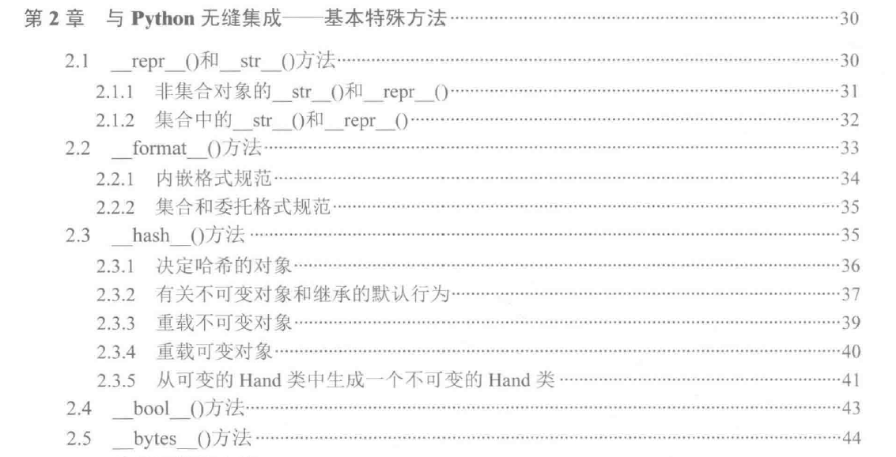
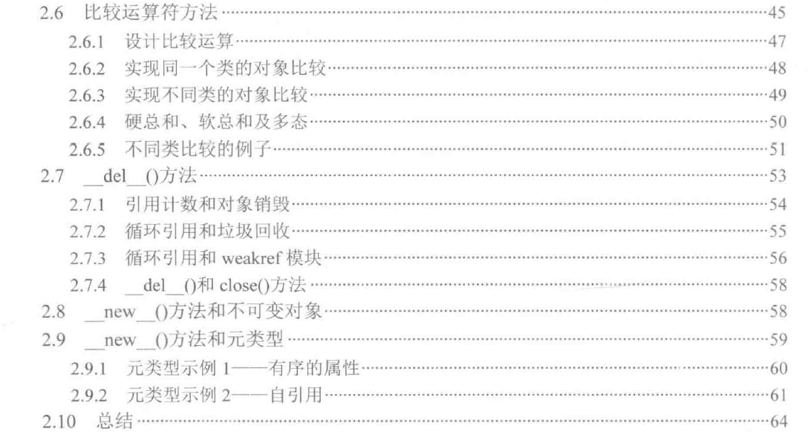

## 与Python无缝集成——基本特殊方法

1. 对象的字符串描述：\__repr__(), \__str__(), \__format__()
2. \__hash__()、\__bool__()、\__bytes__(): 一个对象转换成一个数字、一个布尔值、一串字节
3. 比较云算符： \__lt__()、\__le__()、\__eq__()、\__ne__()、\__gt__()和\__ge__()。
4. \__del__()、\__new__()





## 总结
1. \__repr__(), \__str__() 方法：
- 和内建函数repr()、str()、print()、string.format()是一致的。
- 通常，str()方法表示的对象对用户更加友好，由对象的\__str__()实现。
- repr()方法的表示更加技术化，甚至有可能是一个完整的python表达式。文档写到：对于大多数类型，这个方法会尝试和调用eval()一样的结果。
- print()会调用str()方法输出结果。
- 字符串的format()函数也可以使用这些方法。当使用{!r}或{!s}格式时，我们实际上分别调用了\__repr__()或\__str__()

2. 对象考虑重写\__repr__(), \__str__()
- 非集合对象： 一个不包括任何其他集合对象的“简单”对象，这类对象的格式化通常不会特别复杂。
- 集合对象： 一个包含集合的对象，这类对象的格式化更为复杂。


3. \__hash__()方法
哈希是一种将相对复杂的值转化为小整数的计算方式。
hash()函数（以及与其相关联的\__hash__()方法）主要被用来创建set、frozenset、dict这些集合类型的键。这些集合利用不可变对象的哈希值来高效的查找集合中的对象。
\__hash__()和内部的ID间有很强的依赖关系，哈希值唯一。
\__eq__()和哈希方法有紧密联系。

4. 决定hash的对象
- 并非每个对象都需要提供一个哈希值。当我们创建一个包含有状态、可改变对象的类时，这个类不应该返回哈希值。\__hash__的定义是None.
- 对于不可变对象，可以显示地返回一个哈希值，这样这个对象就可以用作字典中的一个键或者集合中的一个成员。
- 等价性比较有3个层次：
> 哈希值相等
> 比较结果相等
> IDD相等
- 包含适当的相等性比较的可变对象，设置\__hash__=None，并重写__eq__()方法。

5. \__bool__()方法：False, 0, 0.0, '', (), [], {}。
- 使用场景，判断一个对象是否处理完成了。
扩展一个列表（一般不写）：
```
    def __bool__(self):
        return super().__bool__(self)
```

6. \__bytes__()方法
- 只有很少数的场景需要我们把对象转换为字节。
- 根据不同的参数，bytes()函数的行为也不同
> bytes(integer)：返回一个不可变的字节对象，这个对象包含了给定数量的0x00。
> bytes(string)：这个版本会将字符串编码为字节。其他的编码和异常处理的参数会定义编码的具体过程。
> bytes(something)： 调用something.\__bytes__()创建字节对象。不要编码或者错误处理函数。 默认情况下所有类都没有提供\__bytes__()方法，除非定义了。


7. 比较运算符方法，运算符和特殊方法的对应关系：
- x<y 调用 x.\__lt__(y)
- x<=y 调用 x.\__le__(y)
- x==y 调用 x.\__eq__(y)
- x!=y 调用 x.\__ne__(y)
- x>y 调用 x.\__gt__(y)
- x>=y 调用 x.\__ge__(y)
- @functools.total_ordering
- 如何比较同一个类的两个对象
- 如何比较不同类的对象

8. \__del__()。
通常更倾向于使用上下文管理器，而不是实现\__del__()

9. \__new__()和不可变对象。
- 一个用途是初始化不可变对象。\__new__()允许创建未初始化的对象。在__init__()被调用之前设置对象的属性。
- 不可变类的__init__()方法很难重载，因此\__new__()方法可以扩展这种类的方法。
- \__new__()天生就是一个静态方法。
- 当需要继承一个不可变的类的时候，不能重载\__init__()方法，取而代之必须重载\__new__()方法在对象创建的过程中扩展基类的行为。
- 当创建元类型的时候。控制如何创建一个类。 Useless = type("Useless", (), {}) 等价于：class Useless:pass

10. 4中应该使用元类的场景：
- 有序的属性：可以使用元类型来保留一个类源码中的文本信息。一个使用内置的type创建的类型会使dict来存储不同的方法和类级属性。
  因为字典是无序的，所以属性和方法没有特别的排列顺所以极有可能这些信息会以和源码中不同的顺序出现。
- 自引用：作为最后一个也是最简单的例子，我们会看看一个类中对自己的引用。我们会设计一个引用了 master类的类。
  这不是一种基类一子类的关系。这是一些平行的子类，但是引用这些子类中的一个作为master。
  为了和它平行的类保持一致，主类需要包含一个指向自身的引用，如果不用元类型，不可能实现这样的行为。
- 元类型被用来创建抽象基类。一个抽象基类基于\__new__()方法来确定子类的完整性。 ————抽象基类设计的一致性
- 元类型可以被用来简化对象序列化的某些方面。  ————序列化和保存一一jSON、 YAML、Pickle、CSV和XML
