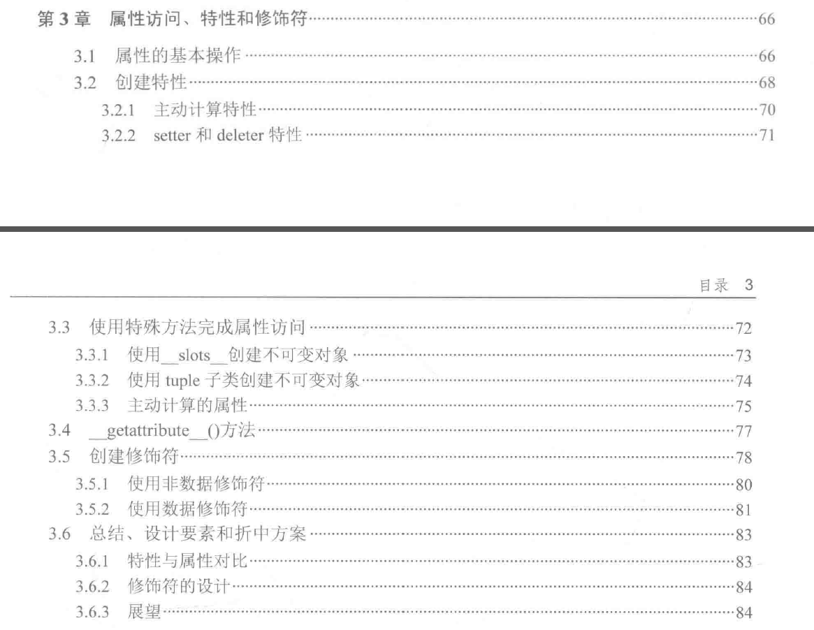

1. 属性访问的5中方式:
- 内部集成属性处理，设置、获取、删除
- @property修饰符，特性扩展了属性的概念，包含了方法的处理
- 底层的特殊方法来控制属性的访问：\__getattr__()、\__setattr__()、\__delattr__()。这些特殊方法会简化属性的处理过程。
- 使用\__getattribute__()方法在更细粒度的层面上操作属性，也可以用来编写特殊的属性处理逻辑。
- 修饰符，设计相对复杂。修饰符在Python中的特性、静态方法和类方法中被广泛使用。

2. 属性的基本操作
- 创建新属性
- 为已有的属性赋值
- 获取属性的值
- 删除属性

3. 特性和\__init__()
- 可选特性更好的完善了类定义，特性通常可以根据类层次结构进行选择性的添加（或删除）

4. 特性的两个基本设计模式
- 主动计算（Eager Calculation）：每当更新特性值时，其他相关特性值都会立即被重新计算。
- 延迟计算（Lazy Calculation）：仅当访问特性时，才会触发计算过程。

5. 使用特殊方法完成属性访问：\__getattr__()、\__setattr__()、\__delattr__()查看属性名称；\__dir__()查看属性访问；\__getattribute__()方法。
- \__setattr__()函数用于属性的创建和赋值
- \__getattr__()：首先如果属性已经被赋值，则不调用直接返回属性即可；其次若果属性没有被赋值，那么直接使用\__getattr__()函数的返回值。若果找不到相关属性，要记得抛出AttributeError异常。
- \__delattr__()用于删除属性
- \__dir__()返回属性名称列表

6. 控制属性访问的设计，可以基于这3个基本的设计出发点：扩展、封装和创建类
- 扩展类。通过写\__setattr__()和\__delattr__()函数是的它几乎是不可变的。也可以使用\__slots__替换内部的__dict__对象。
- 扩展类。提供对象（或对象集合）属性访问的代理实现。这可能需要完全重写和属性相关的那3个函数。
- 创建类并提供和特性功能一样的函数。使用这些方法来对特性逻辑集中处理。
- 创建延迟计算属性，仅当需要时才出发计算过程。对于一些属性，它的值可能来自文件、数据库或网络。这是\__getattr__()函数的常见用法。
- 创建主动计算属性，其他属性更新会相应地更新主动计算属性的值，这是通过重写\__setattr__()函数实现的。

7. 使用\__slots__创建不可变对象。
\__slots__的主要目的是通过限制属性的数量来节约内存。

8. 使用tuple创建不可变对象，继承tuple。

9. 继承dict 来主动计算的属性
- dict类型使用__init__()方法完成字典值的填充，然后判断是否提供了足够的初始化数据。使用了\__setattr__()函数来为字典添加新项，每当属性的赋值操作发生时就会调用_solve()函数。
- 在\__getattr__()函数中，使用None来标识属性的缺失。
- 不能轻易地在类定义的内部对属性赋值。如self.distance = self.rate*self.time 会造成\__setattr__()和_solve()函数之间的无限递归调用。

10. \__getattribute__(self, item)方法提供了对属性更底层的一些操作。
- 默认的实现逻辑是先从内部的\__dict__(或\__slots__)中查找已有的属性。若属性没有找到则调用\__getattribute__()函数。若值是一个修饰符，对修饰符进行处理。否则返回当前值。
- 重写此方法达到的目的：
> 可以有效阻止属性访问。相比于在代码中仅仅使用下划线(__)为开头来吧一个名字标记为私有的方式，这种方法使得属性的封装更彻底。
> 可仿照\__getattr\__()函数的工作方式来创建新属性。在这种情况下，可以绕过\__getattribute\__()的实现逻辑。
> 可以使得属性执行单独或不同的任务。但这样降低程序的可读性和可维护性，这是一个很糟糕的想法。
> 可以改变修饰符的行为。虽然技术上可行，改变修饰符的行为却是个糟糕的想法。

11. 修饰符——可看做属性访问的中介。
- 修饰符类可以被用来获取、赋值或删除属性值，修饰符对象通常在类定义是创建。
- 修饰符模式有两部分：拥有者类（owner class）和属性修饰类（attribute class）。
> 拥有者类使用一个或多个修饰符作为它的属性。在修饰符类中可以定义获取、赋值和删除的函数。一个修饰符类的实例将作为拥有者类的属性。
> 特性是基于拥有者类的函数。修饰符不同于特性，与拥有者类之间没有耦合。因此，修饰符通常可以被重用，是一种通用的属性。拥有者类可同时包含同一个修饰符类的不同实例，管理相似行为的属性。
> 和属性不同，修饰符是在类级别定义的。它的引用并非在\__init__()初始化函数中创建。修饰符可在初始化过程中被创建。修饰符可在初始化过程中被赋值，修饰符通常作为类定义的一部分，处于任何函数之外。
- 当定义拥有者类时，每个修饰符对象都是修饰符类的实例，绑定在类级别的属性上。

12. 为了标识为修饰符，修饰符必须实现以下3个中一个或多个：
- Descriptor.\__get__(self, instance, owner) —>object：在这个方法中，instance参数来自被访问对象的self变量。owner变量是拥有者类的对象。
   如果这个修饰符在类中被调用，instance参数默认值，而value参数为为None。此方法负责返回修饰符的值。
- Descriptor.\__set__(self, instance, value) —>object：在这个方法中，instance参数是被访问对象的self变量，而value参数为即将赋的新值。
- Descriptor.\__delete__(self, instance)：在这个方法中，instance参数是被访问对象的self变量，并在这个方法中实现属性值的删除。
- 有时，修饰符类也需要在\__init__()函数中初始化修饰符内部的一些状态。

13. 基于方法的定义，如下是两种不同的修饰符类型：
- 非数据修饰符：这类修饰符需要定义\__set__()或\__delete__()或两者皆有，但不能定义\__get__()。非数据修饰符对象经常用于构建一些复杂表达式的逻辑。它可能是一个可调用对象，可能包含自己的属性或方法。
  一个不可变的非数据修饰符必须实现\__set__()函数，而逻辑只是单纯的抛出AttributeError异常。这类修饰符的设计相对简单一些，因为接口更灵活。
- 数据修饰符：这类修饰符至少定义\__get__()函数。通常，可通过定义\__get__()和\__set__()函数来创建一个可变对象。这类修饰符不能定义自己内部的属性或方法，因为它通常是不可见的。
  对修饰符属性的访问，也相应的转换为对修饰符中的\__get__()、\__set__()或\__delete__()方法的调用。这样对设计是一个挑战，因此不会作为首要选择。
  
14. 修饰符的使用场景：
- 类内部的方法被实现为修饰符。他们是非数据修饰符，应用在对象和不同的参数值上。
- property()函数是通过为命名的属性创建数据修饰符来实现的。
- 类方法或静态方法被实现为修饰符，修饰符作用于类而非实例。

15. 设计修饰符时，通常考虑以下3中常见的场景：
- 修饰符对象包含或获取数据。在这种情况下，修饰符对象的self变量是相关的并且修饰符是有状态的。使用数据修饰符时，\__get__()方法用于返回内部数据。使用非数据修饰符时，由修饰符中其他方法或属性提供数据。
- 拥有者类实例包含数据。这种情况下，修饰符对象必须使用instance参数获取拥有者对象中的数据。使用数据修饰符时，\__get__()函数从实例中获取数据。使用非数据修饰符时，由修饰符中其他方法提供数据。
- 拥有者类包含数据。  这种情况下，修饰符对象必须使用owner参数。由修饰符实现的静态方法或类方法的作用范围通常是全局的，这种做法是常见的。

## 总结：
首先来看看上述三个魔法方法的定义吧：
（1）__getattr__(self, item):
在访问对象的item属性的时候，如果对象并没有这个相应的属性，方法，那么将会调用这个方法来处理。。。
这里要注意的时，假如一个对象叫fjs,  他有一个属性：fjs.name = "fjs"，那么在访问fjs.name的时候因为当前对象有这个属性，那么将不会调用__getattr__()方法，而是直接返回了拥有的name属性了
（2）__setattr__(self, item, value):
当试图对象的item特性赋值的时候将会被调用。。
（3）__getattribute__(self, item):
这个只有在新式类中才有的，对于对象的所有特性的访问，都将会调用这个方法来处理。。。可以理解为在__getattr__之前
嗯。。。有了这几个方法就可以干很多很多的事情了。。。例如拦截器啥的。。。动态代理啥的。。。

