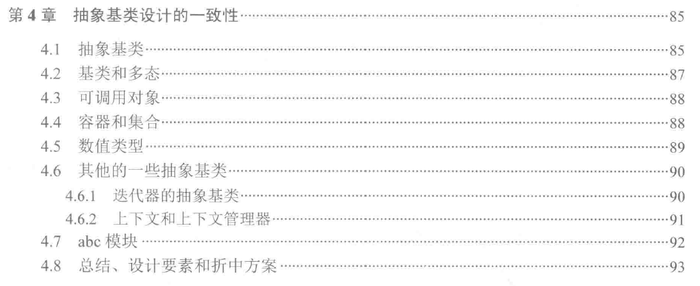

## 抽象基类设计的一致性。

内置的容器类 list、map、set
collections.abc

1. 抽象基类具有以下特性：
- 抽象意味着这些类中不包括我们需要的所有方法的定义。为了让他成为一个正真有用的子类，我们需要提供一些子类。
- 基类意味着其他类会把它当做基类来使用。
- 抽象基类本身提供了一些方法的定义。更重要的是，抽象基类为缺失的函数提供了方法签名。子类必须提供正确的方法创建符合抽象类定义的接口的具体来。

2. 抽象类的设计初衷
- 为python的内部类和程序中自定义类定义一组一致的基类。
- 创建一些通用的、可重用的抽象。
- 支持适当的检查，以确定一个类的功能。

3. 一下情形可以考虑抽象基类
- 自定义类时，使用抽象基类作为基类。
- 在一个方法中使用抽象基类来确保一种操作是可行的。
- 在诊断信息或异常中使用抽象基类来指出一种操作为什么不能生效。

4. 高级的特性
- 内置的容器的完整图谱都是用抽象基类来表示的。底层的特性包括collections.abc.Container、collections.abc.Iterable、collections.abc.Sized。而他们同时也是高级构造过程的一部分。
  他们需要一些特性方法，分别是\__contains__(self, x)、\__iter__(self)、\__len__(self)。
- collections.abc.Iterator定义的迭代器。
- collections.abc.Sequence和collections.abc.MutableSequence:她们是list和tuple的抽象基类，具体的序列实现还包括bytes和str。
- collections.abc.MutableMapping: dict的抽象基类，她扩展了collections.abc.Mapping类，但是没有内置具体的实现。
- collections.abc.Set和collections.abc.MutableSet：她们是frozenset和set的抽象基类。

