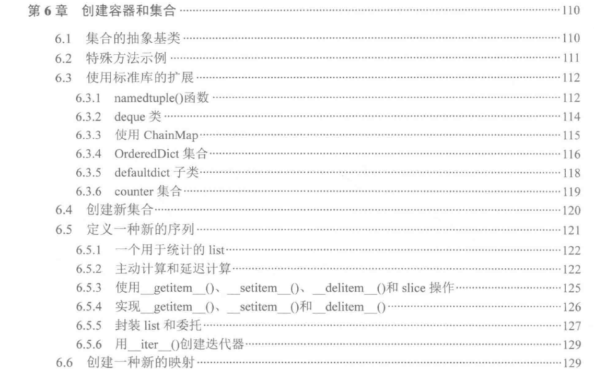
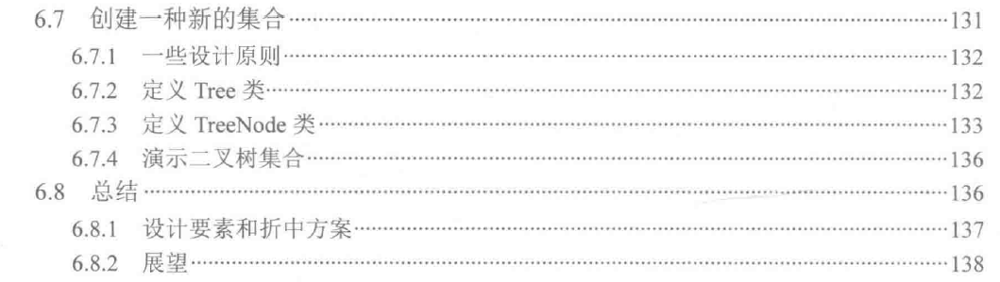

1. 集合的抽象基类
- 内置的容器的完整图谱都是用抽象基类来表示的。底层的特性包括collections.abc.Container、collections.abc.Iterable、collections.abc.Sized。而他们同时也是高级构造过程的一部分。
  他们需要一些特性方法，分别是\__contains__(self, x)、\__iter__(self)、\__len__(self)。
- collections.abc.Iterator定义的迭代器。
- collections.abc.Sequence和collections.abc.MutableSequence:她们是list和tuple的抽象基类，具体的序列实现还包括bytes和str。
- collections.abc.MutableMapping: dict的抽象基类，她扩展了collections.abc.Mapping类，但是没有内置具体的实现。
- collections.abc.Set和collections.abc.MutableSet：她们是frozenset和set的抽象基类。

2. 使用标准库的扩展
- namedtuple(), deque, ChainMap, OrderedDict, defaultdict, Counter, Heapq模块，array模块

3. 定义一种新的序列
- 实现collections.abc.MutableSequence类必须实现的方法：\__getitem__、\__setitem__、\__delitem__、\__len__、insert、append、reverse、extend、pop、remove和\__iadd__。
> \__getitem__：无，因为不涉及状态的改变。
> \__setitem__：这个方法改变了一个元素的状态。需要从总和减去原本元素的值，然后再将新元素的值累加进总和中。
> \__delitem__：这个方法会删除一个元素。需要从总和中移除被删除元素的值。
> \__len__：无，因为不涉及状态的改变
> insert：由于插入一个元素，因此需要将元素累加进总和中。
> append： 添加一个元素，因此需要将元素累加进总和中。
> reverse：无，因为不影响平均值和标准差的计算。
> extend：添加多个元素，例如\__init__，所以在扩展list之前，我们需要处理每个新加入的元素。
> pop：移除元素
> remove：删除元素
> \__iadd__： 这个方法实现了+=增量赋值语句，和extend关键字完全相同。

4. 创建新的映射

5. 创建新的集合

